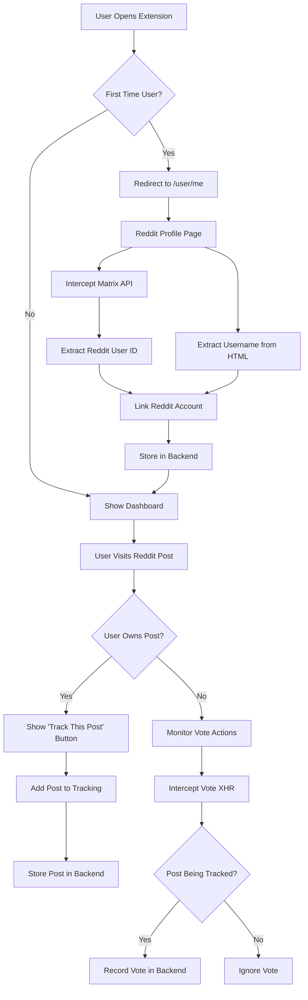

# Reddit Integration Workflow Documentation

## Overview

This document outlines the comprehensive workflow for the TrueVotter Chrome extension's Reddit integration system, including user authentication, post tracking, and vote monitoring.

## System Architecture



## Detailed Workflow Steps

### 1. Initial User Authentication Flow

#### 1.1 Extension First Launch
- **Trigger**: User clicks extension icon for the first time
- **Action**: Extension redirects to `https://www.reddit.com/user/me`
- **Expected Behavior**: 
  - If logged in: Redirects to user profile (e.g., `https://www.reddit.com/user/sihamdisoudani/`)
  - If not logged in: Redirects to login page (`https://www.reddit.com/login/?dest=https%3A%2F%2Fwww.reddit.com%2Fuser%2Fme%2F`)

#### 1.2 Reddit User ID Extraction
- **Method**: Intercept XHR request to Matrix API
- **Endpoint**: `https://matrix.redditspace.com/_matrix/client/v3/account/whoami`
- **Request Type**: GET
- **Expected Response**:
```json
{
    "user_id": "@t2_1uusku7aeq:reddit.com",
    "device_id": "08aa705ab020082d9958df589f98632f",
    "is_guest": false
}
```
- **Data Extraction**: Extract `t2_1uusku7aeq` from `user_id` field

#### 1.3 Reddit Username Extraction
- **Method 1**: Intercept XHR request with username parameter
- **Endpoint Pattern**: `https://www.reddit.com/svc/shreddit/partial/*/mod-content-actions?params=username%3D{username}`
- **Data Extraction**: Extract username from `username=` parameter

- **Method 2**: Parse HTML on profile page
- **HTML Pattern**: 
```html
<p class="m-0 text-14 text-neutral-content-weak font-semibold">
    u/sihamdisoudani
</p>
```
- **Data Extraction**: Extract username from `u/{username}` format

#### 1.4 Account Linking
- **Process**: Send extracted data to backend
- **API Endpoint**: `PATCH /auth/link-reddit`
- **Payload**:
```json
{
    "redditUsername": "sihamdisoudani",
    "redditId": "t2_1uusku7aeq"
}
```
- **UI State**: Display loading state, disable navigation during process

### 2. Post Ownership Detection and Tracking

#### 2.1 Post Ownership Detection
- **Trigger**: User visits Reddit post URL (e.g., `https://www.reddit.com/r/SaaS/comments/1mh8eo2/...`)
- **Detection Method**: Search for "See More Insights" link in HTML
- **HTML Pattern**:
```html
<a rpl="" class="relative no-visited font-semibold a cursor-pointer text-12 hover:underline" 
   href="/poststats/1mh8eo2/" actioned=""> 
    See More Insights
</a>
```
- **Ownership Indicator**: Presence of this link indicates user owns the post

#### 2.2 Track Post Button
- **Display Condition**: Only show when post ownership is detected
- **Button Placement**: Adjacent to "See More Insights" link
- **Button Text**: "Track This Post" or "Add to Tracking"

#### 2.3 Post Data Extraction
- **Post ID**: Extract from URL or HTML (e.g., `1mh8eo2`)
- **Post URL**: Full Reddit post URL
- **Subreddit**: Extract from URL path
- **Post Title**: Extract from page title or HTML

#### 2.4 Post Storage
- **API Endpoint**: `POST /posts`
- **Payload**:
```json
{
    "postId": "1mh8eo2",
    "url": "https://www.reddit.com/r/SaaS/comments/1mh8eo2/...",
    "title": "Post Title",
    "subreddit": "SaaS"
}
```

### 3. Vote Tracking System

#### 3.1 Vote Action Interception
- **Method**: Monitor XHR requests to Reddit's GraphQL endpoint
- **Endpoint**: `https://www.reddit.com/svc/shreddit/graphql`
- **Request Type**: POST
- **Operation Filter**: `UpdatePostVoteState`

#### 3.2 Vote Data Structure
- **Request Payload**:
```json
{
    "operation": "UpdatePostVoteState",
    "variables": {
        "input": {
            "postId": "t3_1mh8eo2",
            "voteState": "DOWN"
        }
    },
    "csrf_token": "c442f5eb87541197b61e5b7959042b56"
}
```

#### 3.3 Vote States
- **UP**: User upvoted the post
- **DOWN**: User downvoted the post  
- **NONE**: User removed their vote (was UP/DOWN, now neutral)

#### 3.4 Vote Processing Logic
1. **Extract Post ID**: Remove `t3_` prefix from `postId` (e.g., `t3_1mh8eo2` → `1mh8eo2`)
2. **Check Post Tracking**: Query backend to verify if post is being tracked
3. **Record Vote**: If post is tracked, store vote data in backend

#### 3.5 Vote Storage
- **API Endpoint**: `POST /votes`
- **Payload**:
```json
{
    "postId": "1mh8eo2",
    "voteType": "downvote",
    "postTitle": "Post Title",
    "subreddit": "SaaS",
    "voterUsername": "current_user",
    "voterRedditId": "t2_voter_id"
}
```

## Implementation Status

### Backend API Endpoints
- [✅ **DONE**]: `POST /auth/register` - User registration
- [✅ **DONE**]: `POST /auth/login` - User authentication  
- [✅ **DONE**]: `PATCH /auth/link-reddit` - Link Reddit account
- [✅ **DONE**]: `POST /posts` - Add post to tracking
- [✅ **DONE**]: `GET /posts` - Retrieve tracked posts
- [✅ **DONE**]: `GET /posts/:postId/is-tracked` - Check if post is being tracked
- [✅ **DONE**]: `POST /votes` - Record vote action
- [✅ **DONE**]: `GET /votes/my-stats` - Get vote statistics

### Chrome Extension Components
- [✅ **DONE**]: Initial redirect to `/user/me`
- [✅ **DONE**]: Matrix API interception for user ID
- [✅ **DONE**]: Username extraction from XHR/HTML
- [✅ **DONE**]: Account linking with loading states
- [✅ **DONE**]: Post ownership detection
- [✅ **DONE**]: "Track This Post" button implementation
- [✅ **DONE**]: Vote XHR interception
- [✅ **DONE**]: Post tracking verification
- [✅ **DONE**]: Vote data processing and storage

### Database Schema
- [✅ **DONE**]: User model with Reddit account fields
- [✅ **DONE**]: Post model for tracking
- [✅ **DONE**]: Vote model for vote records

## Security Considerations

1. **Authentication**: All API calls require valid JWT tokens
2. **Data Validation**: Validate Reddit user IDs and usernames
3. **Rate Limiting**: Implement rate limiting for vote recording
4. **Privacy**: Only track posts explicitly added by post owners
5. **CORS**: Proper CORS configuration for extension communication

## Testing Checklist

- [ ] Extension popup authentication flow
- [ ] Reddit profile redirection and data extraction
- [ ] Account linking with backend
- [ ] Post ownership detection
- [ ] "Track This Post" functionality
- [ ] Vote interception and recording
- [ ] Database persistence verification
- [ ] Error handling and edge cases

## Error Handling

1. **Network Failures**: Retry logic for API calls
2. **Authentication Errors**: Clear stored tokens, prompt re-login
3. **Reddit API Changes**: Graceful degradation if endpoints change
4. **Database Errors**: Queue operations for retry
5. **Extension Permissions**: Handle permission denials gracefully
